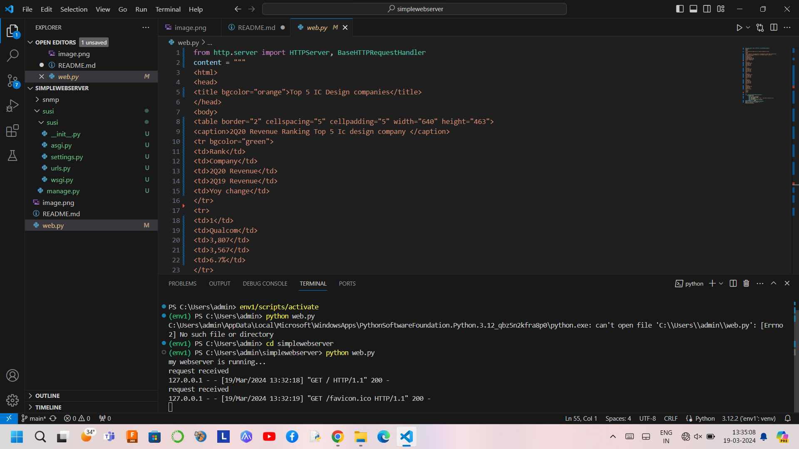

# EX01 Developing a Simple Webserver
## Date:16.02.2024

## AIM:
To develop a simple webserver to serve html pages.

## DESIGN STEPS:
### Step 1: 
HTML content creation.

### Step 2:
Design of webserver workflow.

### Step 3:
Implementation using Python code.

### Step 4:
Serving the HTML pages.

### Step 5:
Testing the webserver.

## PROGRAM:
```
from http.server import HTTPServer, BaseHTTPRequestHandler
content = """
<html>
<head>
<title bgcolor="orange">Top 5 IC Design companies</title>
</head>
<body>
<table border="2" cellspacing="5" cellpadding="5" width="640" height="463">
<caption>2Q20 Revenue Ranking Top 5 Ic design company </caption>
<tr bgcolor="green">
<td>Rank</td>
<td>Company</td>
<td>2Q20 Revenue</td>
<td>2Q19 Revenue</td>
<td>Yoy change</td>
</tr>
<tr>
<td>1</td>
<td>Qualcom</td>
<td>3,807</td>
<td>3,567</td>
<td>6.7%</td>
</tr>
<tr>
<td>2</td>
<td>Nvidia</td>
<td>3,461</td>
<td>2,352</td>
<td>47.1%</td>
</tr>
<tr>
<td>3</td>
<td>Mediatek</td>
<td>2,259</td>
<td>1,977</td>
<td>14.2%</td>
</tr>
<tr>
<td>4</td>
<td>AMD</td>
<td>1,932</td>
<td>1,531</td>
<td>26.2%</td>
</tr>
<tr>
<td>5/td>
<td>Novatek</td>
<td>622</td>
<td>527</td>
<td>18.1%</td>
</tr>
</table>
</body>
</html>

"""
class myhandler(BaseHTTPRequestHandler):
    def do_GET(self):
        print("request received")
        self.send_response(200)
        self.send_header('content-type', 'text/html; charset=utf-8')
        self.end_headers()
        self.wfile.write(content.encode())
server_address = ('',8000)
httpd = HTTPServer(server_address,myhandler)
print("my webserver is running...")
httpd.serve_forever()
```


## OUTPUT:


## RESULT:
The program for implementing simple webserver is executed successfully.
